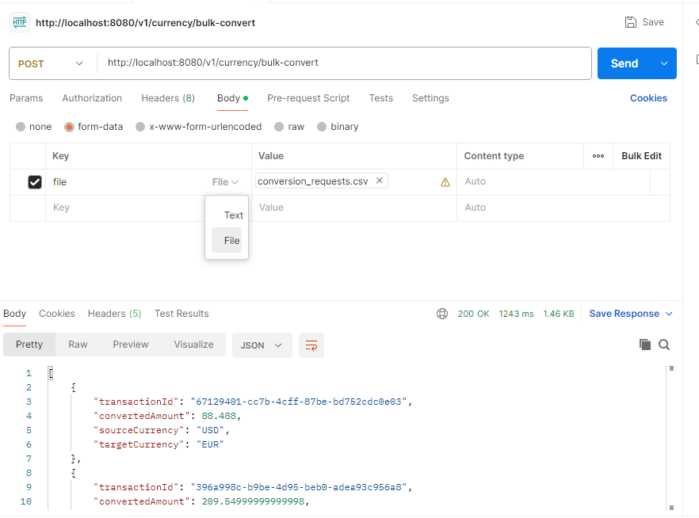

# Foreign Exchange Currencies Project

You will develop a simple foreign exchange application which is one of the most common
services used in financial applications. 
Requirements are as follows:

## Mandatory Functional Requirements:

Exchange Rate Endpoint: -> done
* Input: A pair of currency codes (e.g., USD to EUR).
* Output: The current exchange rate between the two currencies.

Currency Conversion Endpoint: -> done
* Input: An amount in the source currency, source currency code, and target
currency code.
* Output: The converted amount in the target currency and a unique transaction
identifier.

Conversion History Endpoint: -> done
* Input: A transaction identifier or a transaction date for filtering purposes (at least
one must be provided).
* Output: A paginated list of currency conversions filtered by the provided criteria.

External Exchange Rate Integration: ->done
* The application must utilize an external service provider for fetching exchange
rates and optionally for performing the currency conversion calculations.

Bulk File Processing & Conversion: -> done
* Input: A file containing multiple currency conversion requests.
* The API should accept bulk file uploads, process the conversions.
* Support file formats such as CSV.

Error Handling: -> done
* Errors must be handled gracefully, providing meaningful error messages and
specific error codes.

## Mandatory Technical Requirements:

Self-Contained Application: ->done
* The application should require no additional setup or configuration to run.

RESTful API Design: -> done
* Develop the service endpoints following REST principles using Spring Boot.

Build & Dependency Management: -> done
* Use appropriate tools for building the project and managing dependencies.

Use of Design Patterns: -> done
* Implement design patterns appropriately to enhance code quality.

Code Structure: -> done
* The code should be organized to reflect a clear separation of concerns.

Unit Testing:
* Include unit tests to ensure the reliability and robustness of the application.

API Documentation: -> done
* Provide complete and accurate documentation for the API, including request and
response examples.

Docker:
* Containerize the application with Docker to ensure consistency across different
environments.
Proper Use of a Git Repository:

* Maintain the code in a Git repository with a clear history of commits, adhering to
best practices for version control.

Optional Features:

API Documentation Tooling: ->done
* Utilize tools like Swagger or OpenAPI for generating interactive API
documentation.

Caching:

* Apply caching strategies to improve performance, particularly for exchange rate
data.
Hints and Suggestions:

FX Rate Service Providers:  -> done
* You may select any service provider for exchange rates such as currencylayer.com
or fixer.io, considering the limitations of their free offerings.

Spring Boot Resources: -> done
* Refer to Spring Boot's official guides for quick reference and tutorials.
In-Memory Database: -> done
* An in-memory database can be employed for demonstration purposes and ease of
setup.

The detailed API documentation is crucial for users to understand how to interact with the service
effectively. Ensure that the Git repository reflects a professional approach to software
development with meaningful commit messages, feature branches, and pull requests where
applicable.

External exchange api: https://api.frankfurter.dev/v1/

swagger: http://localhost:8080/swagger-ui.html

#### DB Connections
* db: http://localhost:8080/h2-console/
* JDBC URL: jdbc:h2:mem:testdb
* username: sa
* password:

for bulk currency conversion  uploading file same as image
* key: "file"
* value "....csv"

sample values:
amount,sourceCurrency,targetCurrency
100,USD,EUR
250,EUR,GBP
50,GBP,JPY
1000,USD,JPY
75,AUD,CAD
500,EUR,USD
10,EUR,TRY
250,EUR,USD
50,USD,TRY
15,EUR,GBP